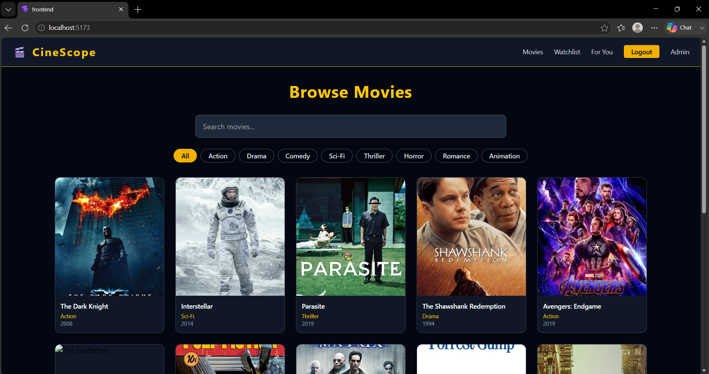

# 🎬 CineScope – Movie Recommendation Platform

A full-stack web application that recommends movies using a Hybrid Machine Learning engine combining Content-Based Filtering and Collaborative Filtering.

## 🚀 Tech Stack

| Layer | Technology |
|---|---|
| Frontend | React.js, Tailwind CSS |
| Backend | Django REST Framework |
| Database | MongoDB, SQLite |
| ML | Python, Scikit-Learn, Pandas, NumPy |

## ✨ Features

- 🔐 JWT Authentication (Register/Login)
- 🎥 Browse, Search & Filter Movies by Genre
- 📋 Personal Watchlist (Add/Remove)
- 🤖 Content-Based Filtering (TF-IDF + Cosine Similarity)
- 👥 Collaborative Filtering (SVD Matrix Factorization)
- 🔀 Hybrid Recommendation Engine (Cold-Start Handling)
- 🎯 Similar Movies on Movie Detail Page
- 🛠️ Admin Dashboard (Add/Edit/Delete Movies, View Users & Watchlists)

## 🗂️ Project Structure

```
cinescope/
├── backend/          # Django REST API
│   ├── users/        # Auth, JWT, Custom User Model
│   ├── movies/       # Movie CRUD APIs
│   ├── watchlist/    # Watchlist APIs
│   ├── recommendations/  # ML Recommendation APIs
│   └── saved_models/ # Trained joblib models
├── frontend/         # React.js App
│   └── src/
│       ├── pages/    # Home, Login, Register, MovieDetail, Watchlist, Admin
│       ├── components/  # Navbar
│       ├── context/  # AuthContext (JWT state)
│       └── api/      # Axios instance
└── ml/               # ML Training Scripts
    ├── dataset/      # movies.csv, ratings.csv
    ├── content_based.py
    ├── collaborative_filtering.py
    └── hybrid_engine.py
```

## ⚙️ Setup Instructions

### Prerequisites
- Python 3.11+
- Node.js 20+
- MongoDB Community Server

### 1. Start MongoDB
```bash
mongod
```

### 2. Backend
```bash
cd backend
python -m venv venv
venv\Scripts\activate
pip install django djangorestframework pymongo djangorestframework-simplejwt django-cors-headers pandas numpy scikit-learn joblib
python manage.py migrate
python manage.py createsuperuser
python manage.py runserver
```

### 3. Seed Movies
```bash
python seed_movies.py
```

### 4. Train ML Models
```bash
cd ../ml
python content_based.py
python collaborative_filtering.py
```

### 5. Copy Models to Backend
```bash
xcopy ml\saved_models backend\saved_models /E /I
```

### 6. Frontend
```bash
cd frontend
npm install
npm run dev
```

Visit `http://localhost:5173`

## 🤖 Machine Learning Module

### Content-Based Filtering
- Combines genre + description into feature tags
- TF-IDF Vectorization (5000 features, bigrams)
- Cosine Similarity matrix (12×12)
- Returns top-N similar movies by angle between vectors

### Collaborative Filtering
- Builds User-Movie rating matrix (8 users × 12 movies)
- SVD (Truncated, 5 latent factors) for matrix factorization
- Predicts ratings for unseen movies per user

### Hybrid Engine
- Blends CB score (40%) + CF score (60%)
- Cold-start detection: < 5 ratings → flips to 80% CB
- Scores normalized to [0,1] before combining
- Returns ranked top-N recommendations

## 🔑 Environment Variables

No `.env` required for local dev. Update `settings.py` for production:

```
SECRET_KEY=your-secret-key
MONGO_URI=mongodb://localhost:27017
MONGO_DB=cinescope_db
```

## 📡 API Endpoints

| Method | Endpoint | Description |
|---|---|---|
| POST | `/api/users/register/` | Register user |
| POST | `/api/users/login/` | Login + get JWT |
| GET | `/api/movies/` | List/search/filter movies |
| GET | `/api/movies/<id>/` | Movie detail |
| POST | `/api/movies/add/` | Add movie (admin) |
| PUT | `/api/movies/<id>/update/` | Edit movie (admin) |
| DELETE | `/api/movies/<id>/delete/` | Delete movie (admin) |
| GET | `/api/watchlist/` | My watchlist |
| POST | `/api/watchlist/add/` | Add to watchlist |
| DELETE | `/api/watchlist/remove/<id>/` | Remove from watchlist |
| GET | `/api/recommendations/content/<id>/` | Similar movies |
| GET | `/api/recommendations/collaborative/` | CF recommendations |
| GET | `/api/recommendations/hybrid/` | Hybrid recommendations |

## 📸 Screenshots


## 👨‍💻 Author

**Tushar Kumar**
Computer Science (Data Science) – SPIT Mumbai
